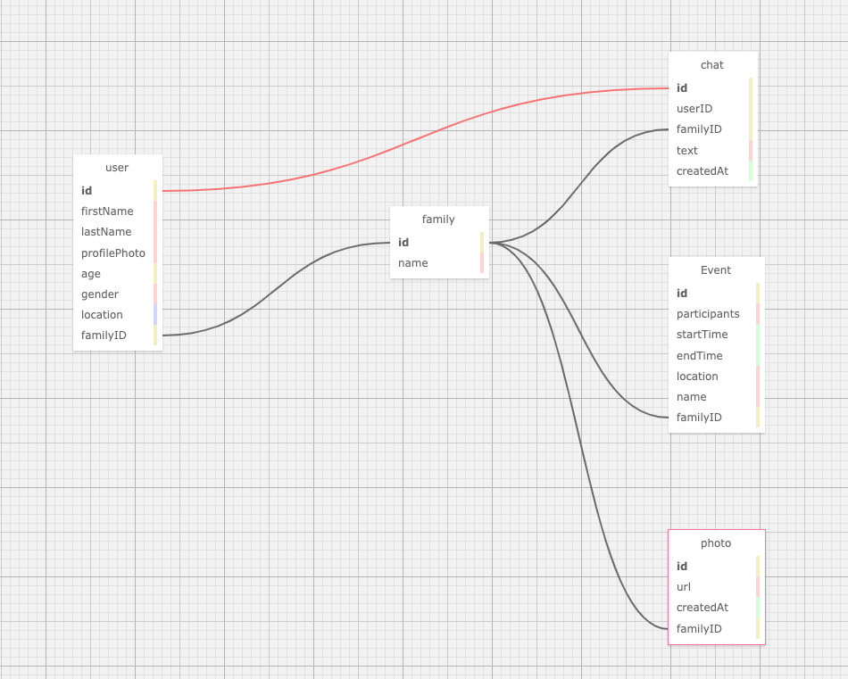

# FamilySpace

<!-- TABLE OF CONTENTS -->

  
Table of Contents

  <ol>
    <li>
      <a href="#about-the-project">About The Project</a>
      <ul>
        <li><a href="#core-features">Core Features</a></li>
        <li><a href="#built-with">Built With</a></li>
      </ul>
    </li>
    <li><a href="#frontend-wip">Frontend (work in progress)</a></li>
    <li>
      <a href="#backend">Backend</a>
      <ul>
        <li><a href="#database">Database</a></li>
        <li><a href="#restful-api">RESTful API</a></li>
      </ul>
    </li>
    <li><a href="#contact">Contact</a></li>
  </ol>

<!-- ABOUT THE PROJECT -->
## About The Project

**FamilySpace** is a web application aimed to build a small social space for your family. Given the mass amount of information in various social media, we would like to create an intimate space for you to connect with your closest people.

### Core Features

* **Home**: you can see your family members, recent photos and upcoming family events
* **Chat**: you can message all your family memebers in real time
* **Map**: you can access other family members location (after permission) in a map

### Built With

* ![Java]
* ![Spring]
* ![Spring-Boot]
* ![Typescript]
* ![React]
* ![React-Router]
* ![Bootstrap]

(<a href="#readme-top">back to top</a>)

## Frontend (WIP)

The UI will map exactly to the core features. The UI would contains three tabs - Home, Chat, Map. The UI portion is still working in progress but please note below current UI for a proof of concept.

(<a href="#readme-top">back to top</a>)

## Backend

The backend system includes a RESTful API (built with Spring Boot) and a MySQL database (built with JPA and Spring Data JPA). The database contains below five entities and the RESTful API has corresponding endpoints to support CRUD opertions for all entities.
* User: contains the user information (name, profile picture, age, gender, current location) and what family the user is associated with
* Family: contains the family name
* Photo: contains all photos for families
* Event: contains all events for families
* Chat: contains all messages for families

### Database
Please note below diagram for attributes for entities and their relationships

### RESTful API

#### User services
* Create
  1. **endpoint**: `"/user"`; **definition**: create a new user and create a new family to associate with the user
  1. **endpoint**: `"/user/{familyID}"`; **definition**: create a new user and add the user to the family
* Read
  1. **endpoint**: `"/user/all"`; **definition**: get all users
  2. **endpoint**: `"/user/{userID}"`; **definition**: get a user
* Update
  1. **endpoint**: `"/user/{userID}"`; **definition**: update user location
  1. **endpoint**: `"/user/{userID}/userinfo"`; **definition**: update user information (e.g name, age and gender)
* Delete - **endpoint**: `"/user/{userID}"`; **definition**: Delete a user

#### Family services
* Create - **endpoint**: `"/family"`; **definition**: create a new family
* Read - **endpoint**: `"/family/{familyID}"`; **definition**: get a family
* Update - **endpoint**: `"/family/{familyID}"`; **definition**: update a family's information
* Delete - **endpoint**: `"/family/{familyID}"`; **definition**: Delete a family

#### Photo services
* Create - **endpoint**: `"/photo/{familyID}"`; **definition**: create a photo for a family
* Read - **endpoint**: `"/photo/{familyID}"`; **definition**: get all photos for a family
* Delete - **endpoint**: `"/photo/{photoID}"`; **definition**: Delete a photo

#### Event services
* Create - **endpoint**: `"/event/{familyID}"`; **definition**: create a event for a family
* Read - **endpoint**: `"/event/{familyID}"`; **definition**: get all events for a family
* Update - **endpoint**: `"/event/{eventID}"`; **definition**: update the event information
* Delete - **endpoint**: `"/photo/{eventID}"`; **definition**: Delete a event

#### Chat services
* Create - **endpoint**: `"/chat/{userID}"`; **definition**: create a chat message posted by the user within his/her family
* Read - **endpoint**: `"/chat`; **definition**: get all messages for a family

(<a href="#readme-top">back to top</a>)

<!-- CONTACT -->
## Contact

Gaoyuan Zhang
* [![github]](https://github.com/gocodezhang)
* [![gmail]](mailto:zgy25483387@gmail.com)

(<a href="#readme-top">back to top</a>)

<!-- MARKDOWN LINKS & IMAGES -->
<!-- https://www.markdownguide.org/basic-syntax/#reference-style-links -->
[Java]: https://img.shields.io/badge/java-%23ED8B00.svg?style=for-the-badge&logo=openjdk&logoColor=white
[Spring]: https://img.shields.io/badge/Spring-6DB33F.svg?style=for-the-badge&logo=Spring&logoColor=white
[Spring-Boot]:https://img.shields.io/badge/Spring%20Boot-6DB33F.svg?style=for-the-badge&logo=Spring-Boot&logoColor=white
[Typescript]: https://img.shields.io/badge/TypeScript-3178C6.svg?style=for-the-badge&logo=TypeScript&logoColor=white
[React]: https://img.shields.io/badge/React-61DAFB.svg?style=for-the-badge&logo=React&logoColor=black
[React-Router]: https://img.shields.io/badge/React%20Router-CA4245.svg?style=for-the-badge&logo=React-Router&logoColor=white
[Bootstrap]: https://img.shields.io/badge/Bootstrap-563D7C?style=for-the-badge&logo=bootstrap&logoColor=white
[github]: https://img.shields.io/badge/GitHub-181717.svg?style=for-the-badge&logo=GitHub&logoColor=white
[gmail]: https://img.shields.io/badge/Gmail-D14836?style=for-the-badge&logo=gmail&logoColor=white